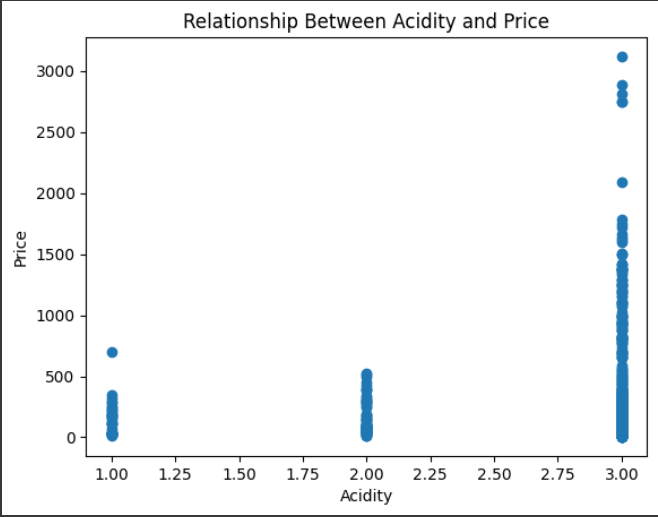
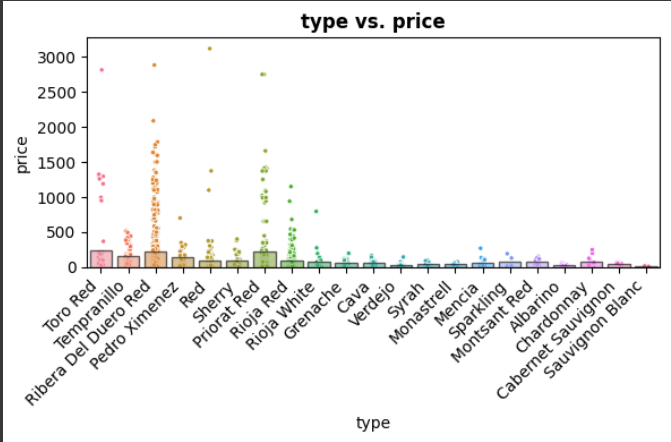

# Machine_learning_price_and_income
## Summary
- This project aims to predict the price of wine based on different properties of the wine. The data contains information on various wines including variety, winery, location, alcohol content, and other chemical properties.
## Business Problem
- Wine producers want to determine fair pricing for their wines based on properties like variety, origin, chemical composition, expert ratings, etc. Setting the right prices is important for wineries to maximize profit margins and compete effectively in the wine market.
## Stakeholders
- Wine producers: Need to price wines optimally based on production costs and market factors
- Wine distributors: Need to understand pricing trends to stock the correct wine inventory
- Wine retailers: Need competitive pricing strategy to attract consumers and maximize sales
- Consumers: Want to know they are getting quality wines at fair prices
## Source of Data
- The data was obtained from the Spanish Wine Quality Dataset on Kaggle. It contains [n] samples of Spanish red and white wines with [m] features including:
-  Variety, country, winery, Location, Expert ratings, Alcohol content, pH levels, Acidity, and more.
- The goal is to use the chemical and physical properties of the wines to predict the price. This is an important business goal for wineries to determine optimal pricing for their products. The data provides an interesting modeling challenge due to the mix of numerical and categorical features.
## Analytical insights
- 
- This scatterplot shows the relationship between acidity levels and price for the wines in the dataset. Each point represents a single wine sample. There is a clear positive correlation between acidity and price.
- 
- This bar chart displays the mean price for each wine type in the dataset. The height of each bar represents the average price of wines of that type. There are noticeable differences in average price between various wine types.
## Model Metrics:

    Algorithm: Random Forest Regressor
    Training MSE: 27,104
    Testing MSE: 50,012
    Training R-squared: 0.672
    Testing R-squared: 0.425
## Business Problem Solving:
- The Random Forest model achieves reasonably low MSE and moderate R-squared, indicating it can predict wine prices fairly accurately based on the wine attributes. The errors are higher than ideal but low enough to provide business value. There is room for improvement but this model serves as a good baseline solution.

## Recommendations:
- Try expanding the dataset with additional samples and variables like expert ratings that may improve predictive power. More data could help reduce errors.
- Tuning hyperparameters like max depth and min samples leaf may help reduce overfitting and improve generalizability. Optimization can enhance performance.
- Assess performance on total new datasets to ensure robustness across different wine price distributions and properties. Validate broader applicability.
- Overall, the Random Forest model provides a moderate solution to the business problem. With more data and tuning, it can become a stronger system for wineries to leverage for pricing decisions.
